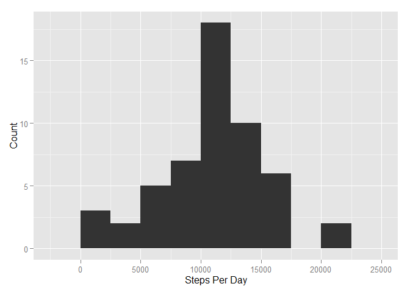
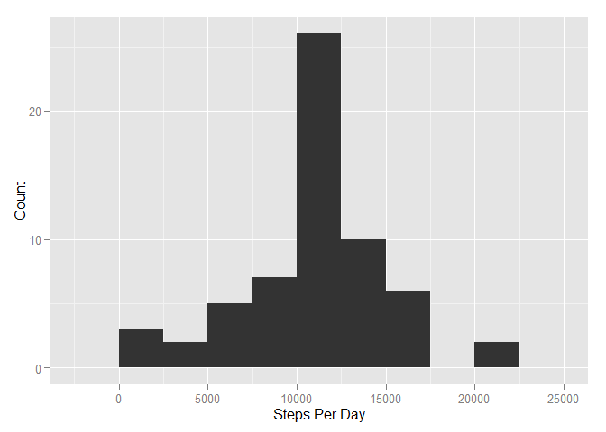
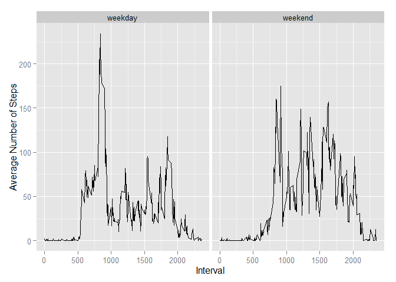

# Reproducible Research: Peer Assessment 1
Kenneth Lee  
October 18, 2015  

**Load and pre-process the data:**


```r
activity <- read.csv(file="activity.csv", header=TRUE, na.strings="NA", stringsAsFactors=FALSE)
activity$date <- as.Date(x=activity$date, format="%Y-%m-%d")
```

**Histogram of the number of steps taken per day:**


```r
library(ggplot2)
```

```
## Warning: package 'ggplot2' was built under R version 3.2.2
```

```r
stepsPerDay <- aggregate(x=activity$steps, by=list(Date=activity$date), FUN=sum)
colnames(stepsPerDay) <- c("Date", "Steps")
qplot(x=stepsPerDay$Steps, geom="histogram", binwidth=2500, xlab="Steps Per Day", ylab="Count")
```

 

**Mean and median of the total number of steps taken per day:**


```r
mean(stepsPerDay$Steps, na.rm=TRUE)
```

```
## [1] 10766.19
```

```r
median(stepsPerDay$Steps, na.rm=TRUE)
```

```
## [1] 10765
```

**What is the average daily activity pattern?**


```r
meanStepsPerInterval <- aggregate(x=activity$steps, by=list(Interval=activity$interval), FUN=mean,
                                  na.rm=TRUE)
colnames(meanStepsPerInterval) <- c("Interval", "AvgSteps")
qplot(x=meanStepsPerInterval$Interval, y=meanStepsPerInterval$AvgSteps, geom="line", 
      xlab="Interval", ylab="Average Number of Steps")
```

 

**Which 5-minute interval, on average across all the days in the dataset, contains the maximum number of steps?**


```r
subset(meanStepsPerInterval, AvgSteps == max(meanStepsPerInterval$AvgSteps))
```

```
##     Interval AvgSteps
## 104      835 206.1698
```

**Number and percentage of missing values are in the dataset:**


```r
nrow(subset(activity, is.na(steps)))
```

```
## [1] 2304
```

```r
nrow(subset(activity, is.na(steps)))/nrow(activity)
```

```
## [1] 0.1311475
```

**Impute missing values with mean value across all days for each interval:**


```r
library(dplyr)
```

```
## Warning: package 'dplyr' was built under R version 3.2.2
```

```
## 
## Attaching package: 'dplyr'
## 
## The following objects are masked from 'package:stats':
## 
##     filter, lag
## 
## The following objects are masked from 'package:base':
## 
##     intersect, setdiff, setequal, union
```

```r
activity2 <- inner_join(activity, meanStepsPerInterval, by=c("interval"="Interval"))
activity2$steps[is.na(activity2$steps)] <- activity2$AvgSteps[is.na(activity2$steps)]
activity2 <- activity2[,-4]
```

**Histogram of the number of steps taken per day using imputed data:**


```r
stepsPerDay2 <- aggregate(x=activity2$steps, by=list(Date=activity2$date), FUN=sum)
colnames(stepsPerDay2) <- c("Date", "Steps")
qplot(x=stepsPerDay2$Steps, geom="histogram", binwidth=2500, xlab="Steps Per Day", ylab="Count")
```

 

```r
mean(stepsPerDay2$Steps, na.rm=TRUE)
```

```
## [1] 10766.19
```

```r
median(stepsPerDay2$Steps, na.rm=TRUE)
```

```
## [1] 10766.19
```

We can see that the general pattern of activity is mostly unchanged with the imputed values, and the frequencies have gone up, which is expected.  The mean has not changed, however the median is slightly changed and is now equal to the mean.

**Are there differences in activity patterns between weekdays and weekends?**


```r
activity <- mutate(activity, dayofweek=weekdays(date))
activity <- mutate(activity, typeofday="weekday")
activity$typeofday[activity$dayofweek %in% c("Saturday","Sunday")] <- "weekend"

meanStepsPerInterval2 <- aggregate(x=activity$steps[activity$typeofday=="weekday"],
                                   by=list(Interval=activity$interval[activity$typeofday=="weekday"]),
                                   FUN=mean, na.rm=TRUE)
meanStepsPerInterval3 <- aggregate(x=activity$steps[activity$typeofday=="weekend"],
                                   by=list(Interval=activity$interval[activity$typeofday=="weekend"]),
                                   FUN=mean, na.rm=TRUE)
meanStepsPerInterval2[,3] <- "weekday"
meanStepsPerInterval3[,3] <- "weekend"
meanStepsPerInterval2 <- rbind(meanStepsPerInterval2, meanStepsPerInterval3)
rm(meanStepsPerInterval3)
colnames(meanStepsPerInterval2) <- c("Interval", "AvgSteps", "DayType")
meanStepsPerInterval2$DayType <- as.factor(meanStepsPerInterval2$DayType)

ggplot(data=meanStepsPerInterval2, aes(x=Interval, y=AvgSteps)) + geom_line() + facet_grid(.~DayType) +
    xlab("Interval") + ylab("Average Number of Steps")
```

 

We can see there are clear differences in activity patterns on weekdays versus weekends.  On weekdays, there is a spike in activity in the morning, then a lull in activity during the day, followed by a less prominent spike in the evening.  On weekends, during the day, activity is more evenly distributed, with no big spikes.
